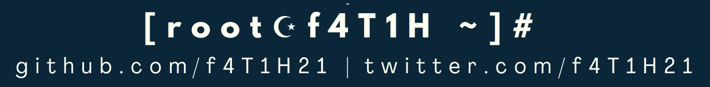

<h2>Hi, my name is Şefik Efe aka f4T1H 👋 
  
</h2>

An interesting high school student interested in [security research, software development] on [Web technologies, Linux, IoT and Blockchain]. • I generally use <i>f4T1H</i> as my nickname and <i>f4T1H21</i> as my username.

<h3>🔗 Let's connect</h3>
<!-- got badge colors from simpleicons.org -->

  <!-- LinkedIn -->
  &nbsp;
  <!-- YouTube -->
  &nbsp;
  <!-- GitHub -->
  &nbsp;
  <!-- Twitter -->
  &nbsp;
  <!-- Hack The Box -->
  &nbsp;
  <!-- HackerOne -->
  &nbsp;
  <!-- Buy Me A Coffee -->
  &nbsp;
  <!-- Arch Linux Forums -->
  

<h3>🌐 Technologies I deal with</h3>

  <!-- Python -->
  &nbsp;
  <!-- Bash -->
  &nbsp;
  <!-- PHP -->
  &nbsp;
  <!-- JavaScript -->
  &nbsp;
  <!-- HTML -->
  &nbsp;
  <!-- CSS -->
  &nbsp;
  <!-- MicroPython -->
  &nbsp;
  <!-- Flask -->
  &nbsp;
  <!-- NodeJS -->
  &nbsp;
  <!-- MySQL -->
  &nbsp;
  <!-- PostgreSQL -->
  &nbsp;
  <!-- Git -->
  &nbsp;
  <!-- Docker -->
  &nbsp;
  <!-- Arch -->
  &nbsp;
  <!-- Debian -->
  &nbsp;
  <!-- Kali -->
  &nbsp;
  <!-- Raspberry Pi -->
  &nbsp;
  <!-- ESP32 -->
  &nbsp;
  <!-- LoRa -->
  &nbsp;  

<h3>📝 Hack The Box Writeups: <a href="https://git.io/htb-writeups">
  git.io/htb-writeups
  </a>
  
  
</h3>

<h3>📺 Latest <a href="https://www.youtube.com/SiberG%C3%BCvenlikT%C3%BCrk%C3%A7e">YouTube</a> Videos</h3>

<!-- YOUTUBE-VIDEOS-LIST:START -->
- [RSA Temelleri ve Python ile Uygulamalı Challenge Çözümü](https://www.youtube.com/watch?v=P7RpaRVAV6w)
- [IDOR Zaafiyeti | Dice CTF&#39;22 Knock-Knock | Türkçe Anlatım](https://www.youtube.com/watch?v=kW6I2NnZfoQ)
- [Wildcard Injection - Python FTP - WordPress - Rbash | TryHackMe Jeff | Türkçe Anlatım](https://www.youtube.com/watch?v=OJvOKAAd-p0)
- [Kali Linux Kurduktan Sonra 6 Ayar | Türkçe Anlatım](https://www.youtube.com/watch?v=rIb1A11TUVU)
- [Kali Linux Virtualbox Kurulum | Türkçe Anlatım + Kanal Hakkında](https://www.youtube.com/watch?v=w8JFnbOniwk)
<!-- YOUTUBE-VIDEOS-LIST:END -->
&emsp;➡️ [more videos](https://www.youtube.com/SiberG%C3%BCvenlikT%C3%BCrk%C3%A7e)

  
  

  
 

<b><i>─ Written by f4T1H ─</i></b>
